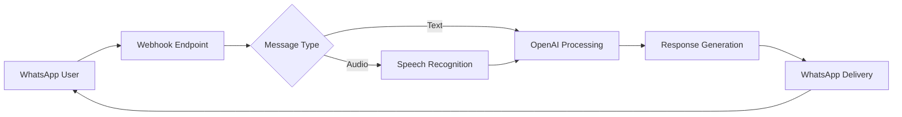

# WhatsApp AI Assistant

<div align="center">
  
  <br>
  <em>AI-powered WhatsApp chatbot with voice and text capabilities</em>
</div>

## 🚀 Quick Start

Create your own AI-powered WhatsApp assistant in 5 simple steps:

### 1. **Get OpenAI API Access**
   - Create an account at [OpenAI Platform](https://platform.openai.com/)
   - Generate your API key from the dashboard

### 2. **Setup Meta Developer Account**
   - Register at [Meta for Developers](https://developers.facebook.com/)
   - Verify your business (if required)

### 3. **Create WhatsApp Business App**
   - Go to [Meta App Dashboard](https://developers.facebook.com/apps)
   - Create a new "WhatsApp Business" application
   - Generate your permanent access token

### 4. **Deploy the Application**
   ```bash
   # Option A: Remix on Glitch
   https://glitch.com/~whatsapp-openai-webhook-python
   
   # Option B: Local deployment
   git clone https://github.com/gustavz/whatsbot.git
   cd whatsbot
   pip install -r requirements.txt
   ```

### 5. **Configure Environment & Webhook**
   ```python
   # Set these environment variables:
   OPENAI_API_KEY=your_openai_key_here
   WHATSAPP_TOKEN=your_whatsapp_token_here
   VERIFY_TOKEN=your_custom_verification_token
   ```
   
   - Connect your deployment URL as a webhook in WhatsApp Business settings
   - Don't forget to ⭐ star this repository!

## 🧠 How It Works

### Architecture Overview


### Core Features

- **🤖 Smart Conversations**: GPT-3.5 Turbo powered responses with context awareness
- **🎙 Voice Message Support**: Automatic speech-to-text conversion for audio messages
- **💬 Multi-format Handling**: Seamlessly processes text and audio inputs
- **🔄 Session Management**: Maintains conversation history for contextual responses
- **⚡ Real-time Processing**: Instant response generation and delivery

## 🛠 Technical Implementation

### Dependencies & Technologies

```python
# Core Framework
Flask==2.3.3           # Web framework for handling HTTP requests
openai==0.28.1         # OpenAI API client for GPT integration

# Audio Processing
SpeechRecognition==3.10.0  # Convert speech to text
pydub==0.25.1          # Audio format manipulation
soundfile==0.12.1      # Audio file I/O operations

# HTTP & Utilities
requests==2.31.0       # HTTP client for API calls
python-dotenv==1.0.0   # Environment variable management
```

### Key Components

#### 1. **Webhook Verification**
```python
def verify_webhook(request):
    """
    Validates incoming webhook requests from WhatsApp
    Ensures secure and authenticated communication
    """
    mode = request.args.get("hub.mode")
    token = request.args.get("hub.verify_token")
    challenge = request.args.get("hub.challenge")
    
    if mode == "subscribe" and token == VERIFY_TOKEN:
        print("✅ Webhook verified successfully")
        return challenge, 200
    else:
        print("❌ Webhook verification failed")
        return "Verification failed", 403
```

#### 2. **Message Processing Pipeline**
```python
def process_incoming_message(body):
    """
    Main message processing workflow
    Handles both text and audio messages
    """
    message = extract_message_data(body)
    
    if message["type"] == "text":
        user_input = message["text"]["body"]
    elif message["type"] == "audio":
        user_input = convert_audio_to_text(message["audio"]["id"])
    
    # Generate AI response
    ai_response = generate_ai_response(user_input, message["from"])
    
    # Send response back to user
    send_whatsapp_reply(message, ai_response)
```

#### 3. **Audio Processing Engine**
```python
def process_audio_message(audio_id):
    """
    Converts WhatsApp audio messages to text
    Supports various audio formats and qualities
    """
    # Download audio file from WhatsApp servers
    audio_url = get_media_url(audio_id)
    audio_content = download_media(audio_url)
    
    # Convert OGG to WAV format
    audio_segment = AudioSegment.from_ogg(io.BytesIO(audio_content))
    audio_segment = audio_segment.set_sample_width(4)  # Enhance quality
    
    # Convert to speech recognition compatible format
    wav_data = audio_segment.export(format="wav").read()
    audio_data, sample_rate = sf.read(io.BytesIO(wav_data), dtype="int32")
    
    # Perform speech-to-text
    recognizer = sr.Recognizer()
    audio = sr.AudioData(audio_data, sample_rate, 4)
    text = recognizer.recognize_google(audio)
    
    return f"Please summarize: {text}"
```

#### 4. **AI Response Generation**
```python
def generate_ai_response(user_message, user_id):
    """
    Creates contextual AI responses using OpenAI GPT
    Maintains conversation history for each user
    """
    # Update conversation history
    update_conversation_history(user_id, "user", user_message)
    
    try:
        response = openai.ChatCompletion.create(
            model="gpt-3.5-turbo",
            messages=get_conversation_history(user_id),
            temperature=0.7,  # Balance creativity and consistency
            max_tokens=500    # Control response length
        )
        
        ai_response = response.choices[0].message.content
        update_conversation_history(user_id, "assistant", ai_response)
        
        return ai_response
        
    except Exception as error:
        print(f"OpenAI API error: {error}")
        return "I'm experiencing technical difficulties. Please try again later."
```

#### 5. **WhatsApp Message Delivery**
```python
def send_whatsapp_message(recipient, message_content):
    """
    Delivers responses back to users via WhatsApp Cloud API
    """
    headers = {
        "Authorization": f"Bearer {WHATSAPP_TOKEN}",
        "Content-Type": "application/json"
    }
    
    payload = {
        "messaging_product": "whatsapp",
        "to": recipient,
        "type": "text",
        "text": {"body": message_content}
    }
    
    response = requests.post(
        f"https://graph.facebook.com/v15.0/{PHONE_NUMBER_ID}/messages",
        json=payload,
        headers=headers
    )
    
    if response.status_code == 200:
        print("✅ Message delivered successfully")
    else:
        print(f"❌ Message delivery failed: {response.text}")
```

## 📁 Project Structure

```
whatsbot/
├── app.py                 # Main Flask application
├── requirements.txt       # Python dependencies
├── .env                  # Environment variables (create this)
├── src/
│   ├── webhook.py        # Webhook verification and handling
│   ├── message_processor.py  # Message routing and processing
│   ├── audio_handler.py  # Speech-to-text functionality
│   ├── openai_client.py  # AI response generation
│   └── whatsapp_api.py   # WhatsApp Cloud API interactions
└── utils/
    ├── config.py         # Configuration management
    ├── logger.py         # Logging utilities
    └── helpers.py        # Common helper functions
```

## 🔧 Advanced Configuration

### Environment Variables
```bash
# Required
OPENAI_API_KEY=sk-your-openai-key-here
WHATSAPP_TOKEN=your-whatsapp-business-token
VERIFY_TOKEN=your-custom-verification-string

# Optional
DEBUG=False
LOG_LEVEL=INFO
MAX_HISTORY_LENGTH=10
```

### Customization Options

#### 1. **Response Personality**
```python
SYSTEM_PROMPT = """
You are a helpful WhatsApp assistant. 
Be concise, friendly, and helpful in your responses.
Keep responses under 3 sentences when possible.
"""
```

#### 2. **Audio Processing Settings**
```python
AUDIO_CONFIG = {
    "sample_rate": 16000,
    "channels": 1,
    "format": "wav",
    "max_duration": 300  # 5 minutes max
}
```

## 🚨 Error Handling & Troubleshooting

### Common Issues

1. **Webhook Verification Fails**
   - Check VERIFY_TOKEN matches in both settings
   - Ensure webhook URL is accessible

2. **Audio Processing Errors**
   - Verify audio file permissions
   - Check internet connectivity for speech recognition

3. **OpenAI API Limits**
   - Monitor usage in OpenAI dashboard
   - Implement rate limiting if needed

### Logging & Monitoring
```python
import logging

logging.basicConfig(
    level=logging.INFO,
    format='%(asctime)s - %(name)s - %(levelname)s - %(message)s'
)
```

## 🌟 Deployment Options

### 1. **Glitch (Recommended for beginners)**
- Click "Remix" on the Glitch project
- Add environment variables in .env file
- Your app is live instantly!

### 2. **Heroku**
```bash
heroku create your-whatsbot-app
heroku config:set OPENAI_API_KEY=your_key
git push heroku main
```

### 3. **PythonAnywhere**
- Upload files via web interface
- Configure virtual environment
- Set up scheduled tasks for reliability

### 4. **Local Development**
```bash
python -m venv venv
source venv/bin/activate  # Linux/Mac
# OR
venv\Scripts\activate     # Windows

pip install -r requirements.txt
python app.py
```

## 📈 Performance Optimization

### Caching Strategies
```python
from functools import lru_cache

@lru_cache(maxsize=100)
def get_cached_response(user_input):
    # Cache frequent responses to reduce API calls
    pass
```

### Rate Limiting
```python
from flask_limiter import Limiter

limiter = Limiter(
    app,
    key_func=get_remote_address,
    default_limits=["200 per day", "50 per hour"]
)
```

## 🔒 Security Best Practices

- Use environment variables for sensitive data
- Implement request validation
- Add rate limiting to prevent abuse
- Regularly update dependencies
- Monitor for suspicious activity

## 🤝 Contributing

We welcome contributions! Please see our [Contributing Guide](CONTRIBUTING.md) for details.

1. Fork the repository
2. Create a feature branch (`git checkout -b feature/amazing-feature`)
3. Commit your changes (`git commit -m 'Add amazing feature'`)
4. Push to the branch (`git push origin feature/amazing-feature`)
5. Open a Pull Request

## 📄 License

This project is licensed under the MIT License - see the [LICENSE](LICENSE) file for details.

## 🆘 Support

- 📚 [Documentation Wiki](https://github.com/gustavz/whatsbot/wiki)
- 🐛 [Issue Tracker](https://github.com/gustavz/whatsbot/issues)
- 💬 [Discussions](https://github.com/gustavz/whatsbot/discussions)

---

<div align="center">
  <p>Made with ❤️ by the open-source community</p>
  <p>If this project helps you, please give it a ⭐!</p>
</div>